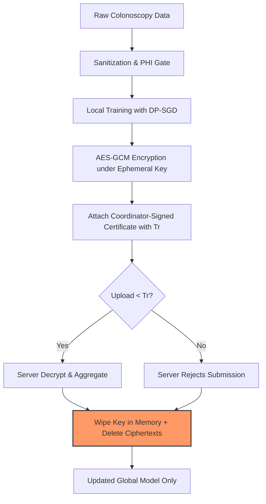

# Self-Destructing Federated Learning (SDFL) for Colorectal Polyp Segmentation

This repository hosts the working prototype for **Self-Destructing Federated Learning (SDFL)** applied to colorectal polyp segmentation. SDFL is a novel systems architecture that introduces **temporal privacy** into collaborative clinical AI, treating model updates as short-lived, sensitive assets that automatically expire and become cryptographically unrecoverable after aggregation.

---

## 🌟 Inventive Core & Patent Novelty

Traditional privacy-preserving Federated Learning (FL) focuses on preventing unauthorized intercept during training. However, stored model updates, cached gradients, and transmission logs remain vulnerable to **post-breach retrospective attacks** (e.g., gradient reconstruction or membership inference). 

SDFL addresses this post-breach threat model through a protocol-enforced **temporal decay mechanism**:



### The Three Pillars of SDFL (Patent Claims)
1. **Round-Specific Ephemeral Cryptographic Context**: Each training round generates a unique AES-GCM key context and is bound to a coordinator-signed certificate carrying a dynamic expiry timestamp ($T_r$).
2. **Bounded Aggregation Window Enforcement**: The server validates the round certificate and arrival time, strictly rejecting late submissions, replayed tokens, or context-mismatched uploads.
3. **In-Memory Self-Destruction**: Once aggregation closes or the timestamp $T_r$ is reached, the server and clients execute in-place zeroing (`destroy_round_key`) of mutable key bytes and purge cached ciphertexts. The global model is updated, but individual updates are rendered mathematically unrecoverable.

---

## 📊 Ablation Experiments & Key Results

We conducted 8 incremental ablation experiments (E1 to E8) to benchmark utility, privacy protection, and system overhead.

### Experiment Configurations & Metrics

| Exp | Description | Focus Metric | Results / Performance | Status |
| :--- | :--- | :--- | :--- | :--- |
| **E1** | Centralized Baseline | Target Dice | **Dice: 0.7937** \| **IoU: 0.7159** (Upper Bound) | Complete |
| **E2** | Federated Baseline (FedAvg) | Non-IID client split | **Dice: 0.7712** \| **IoU: 0.6818** (Utility Drop) | Complete |
| **E3** | FedProx Integration | Proximal term ($\mu$) | **Dice: 0.5782** \| **IoU: 0.4533** (Best: $\mu = 0.001$, Round 1) | Complete |
| **E4** | DP-SGD Integration | Privacy Budget ($\epsilon$) | **Dice: 0.4312** \| **$\epsilon = 0.9793$** at $\delta = 10^{-5}$ ($C=2, \sigma=1.5$) | Complete |
| **E5** | Secure Aggregation | Decryption Success | **Dice: 0.4271** \| **Decryption: 100%** (AES-GCM overhead: 0.08s) | Complete |
| **E6** | Sanitization Pipeline | PHI removal + Contrast | **Dice: 0.5400** \| **IoU: 0.4081** (Jumps +11.3% absolute Dice) | Complete |
| **E7** | Temporal Key Destruction | In-memory zeroing | **5/5 Verification Tests Passed** (Late uploads rejected) | Complete |
| **E8** | Full SDFL Stack | Uncertainty / OOD | **$\epsilon = 2.7720$** \| **ID Dice: 0.4145** \| **OOD Dice: 0.4869** \| **ECE: 0.0888** | Complete |

> [!IMPORTANT]
> **Key Patent Insight (E6 Validation):** While differential privacy (DP-SGD) typically degrades model utility, incorporating client-side sanitization (CLAHE contrast normalization, overlay text inpainting, and metadata scrubbing) successfully filtered PHI leaks *and* restored performance—improving validation Dice by **+11.3% absolute points** under strict privacy budgets.

---

## 📂 Project Architecture & File Inventory

The workspace is organized into a modular design mapping data splits, network components, cryptography protocols, and local scripts:

```
├── E1_Baseline.ipynb                 # Centralized baseline model script
├── E8_Full_SDFL.ipynb                # Full Ray-based FL simulation notebook
├── E1_E2_RESULTS.md                  # Detailed metrics for centralized/federated runs
├── E3_RESULTS.md                     # FedProx proximal sweep results
├── E4_RESULTS.md                     # DP-SGD privacy budget trade-off sweeps
├── E5_RESULTS.md                     # Secure Aggregation implementation & metrics
├── E6_RESULTS.md                     # Sanitization pipeline execution logs
├── E7_RESULTS.md                     # Temporal verification security test logs
├── E8_RESULTS.md                     # Full stack final benchmark report
├── config.py                         # Single source of truth settings
├── model.py                          # ResUNet++ segmentation model definition
├── losses.py                         # DiceBCE custom loss function implementation
├── crypto.py                         # AES-GCM encryption, HMAC signing & zeroing
├── e2_server.py                      # Federated learning base server
├── e6_server.py                      # Sanitization pipeline & validation client/server
├── e7_temporal.py                    # Temporal strategy with verification tests
├── e8_server.py                      # Full stack simulation with uncertainty evaluation
├── skipped_samples.log               # Record of files rejected by local PHI Gate
├── audit_log.jsonl                   # Append-only secure timeline verification log
├── scripts/
│   ├── setup_data.py                 # Kvasir-SEG dataset loader and download script
│   ├── make_splits.py                # Stratified and non-IID hospital split generator
│   ├── dataset.py                    # PyTorch dataset wrapping & augmentation loaders
│   ├── joint_transforms.py           # Combined image/mask data augmentations
│   ├── sanitize.py                   # CLAHE, text overlay inpainter & PHI gate
│   └── visual_check.py               # Mask-overlap validation visual check script
```

---

## 🛠️ Step-by-Step Execution Guide

### 1. Environment Setup
Clone the repository and install dependencies inside a virtual environment:
```bash
python3 -m venv .venv
source .venv/bin/activate
pip install -r requirements.txt
```

### 2. Data Ingestion & Splitting
Run scripts to pull the Kvasir-SEG dataset, split it into stratified trains/vals, and create biased non-IID hospital splits for the 3 clients:
```bash
python scripts/setup_data.py
python scripts/make_splits.py
```
*(Optional) Run sanity visualization checks on augmentation masks:*
```bash
python scripts/visual_check.py --n 5
```

### 3. Running the Base System
Train the centralized baseline model:
```bash
# Runs the centralized training script
python scripts/dataset.py  
```

### 4. Running the Temporal Security Tests (E7 Verification)
Verify client-side key zeroing, timestamp rejection windows, and HMAC signatures:
```bash
# Runs the 5 core verification tests and temporal simulation
python e7_temporal.py --test_only
```

### 5. Running the Full SDFL Ray Simulation (E8)
Execute the complete Ray/Flower simulation stack (DP-SGD, SecAgg, Sanitization, Temporal Expiry, and Uncertainty Head):
```bash
# Run simulation for 5 rounds
python e8_server.py --rounds 5
```

---

## 📄 License & Intellectual Property
* This project is a working prototype of a **Patent Application (India)**.
* Core systems mechanisms, temporal revocation models, and image-sanitization gates are protected under proprietary research agreements.